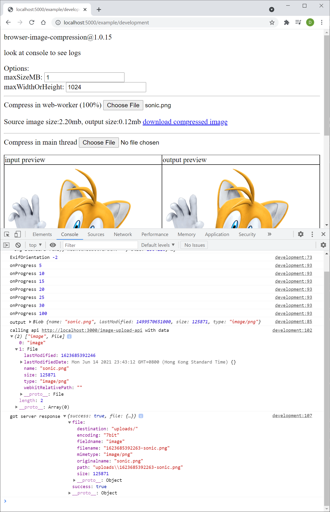

# Example Node.js ExpressJS server
> this is an example to demonstrate the file upload from browser through calling API

## Run server
```bash
yarn install
yarn dev
```

## Run sample frontend
1. Open: https://donaldcwl.github.io/browser-image-compression/example/basic.html
2. Choose a file to compress, then the output will be uploaded to "http://localhost:3000/image-upload-api"


## Sample frontend HTML
```html
<script src="https://cdn.jsdelivr.net/npm/promise-polyfill@8/dist/polyfill.min.js"></script>
<script type="text/javascript" src="https://cdn.jsdelivr.net/npm/browser-image-compression@2.0.2/dist/browser-image-compression.js"></script>
<input type="file" accept="image/*" onchange="compressImage(event);">
<script>
    function compressImage (event) {
        const file = event.target.files[0]
        const options = {
            maxSizeMB: 1,
            maxWidthOrHeight: 1024,
        }
        imageCompression(file, options)
            .then(output => uploadToServer(output))
            .catch(err => console.error(err))
    }

    function uploadToServer (file) {
        const formData = new FormData()
        formData.append('image', file, file.name)
        const url = 'http://localhost:3000/image-upload-api'
        console.log('calling api', url, 'with data', Array.from(formData.entries())[0])
        return fetch(url, {
            method: 'POST',
            body: formData
        })
            .then(res => res.json())
            .then(body => console.log('got server response', body))
    }
</script>
```